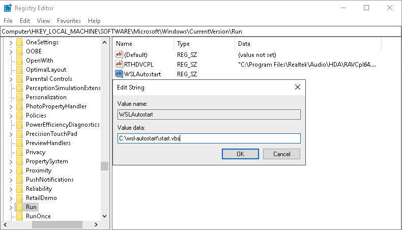

# WSL Autostart
Support for starting linux services in Windows Subsystem for Linux (WSL) on Windows startup.

[README](README.md) | [中文文档](README_zh.md)

## Table of Contents

* [Installation](#Installation)
* [Usage](#Usage)

## Installation

* Use git clone to any directory (e.g `C:\wsl-autostart`)
``` shell
git clone https://github.com/troytse/wsl-autostart
```

* Add a startup item to the registry.


* Add a string item under `HKEY_LOCAL_MACHINE\SOFTWARE\Microsoft\Windows\CurrentVersion\Run` (e.g `WSLAutostart`)


* Set the path to the script (e.g `C:\wsl-autostart\start.vbs`)


## Usage

* Modify the `/etc/sudoers` file in WSL, Specified the service commands calling without password for the require auto starting.
e.g:
``` sudoers
%sudo ALL=NOPASSWD: /etc/init.d/cron
%sudo ALL=NOPASSWD: /etc/init.d/ssh
%sudo ALL=NOPASSWD: /etc/init.d/mysql
%sudo ALL=NOPASSWD: /etc/init.d/apache2
```
* Modify the `commands.txt` file to specify the service commands.
e.g:
``` shell
/etc/init.d/cron
/etc/init.d/ssh
/etc/init.d/mysql
/etc/init.d/apache2
```